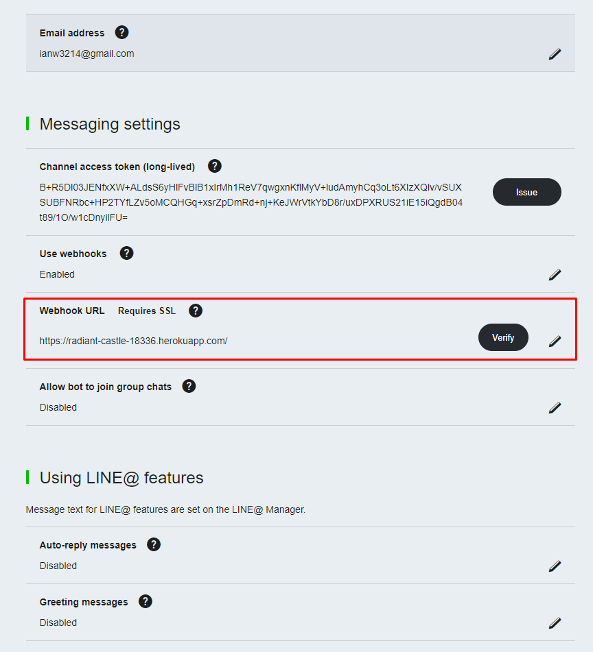
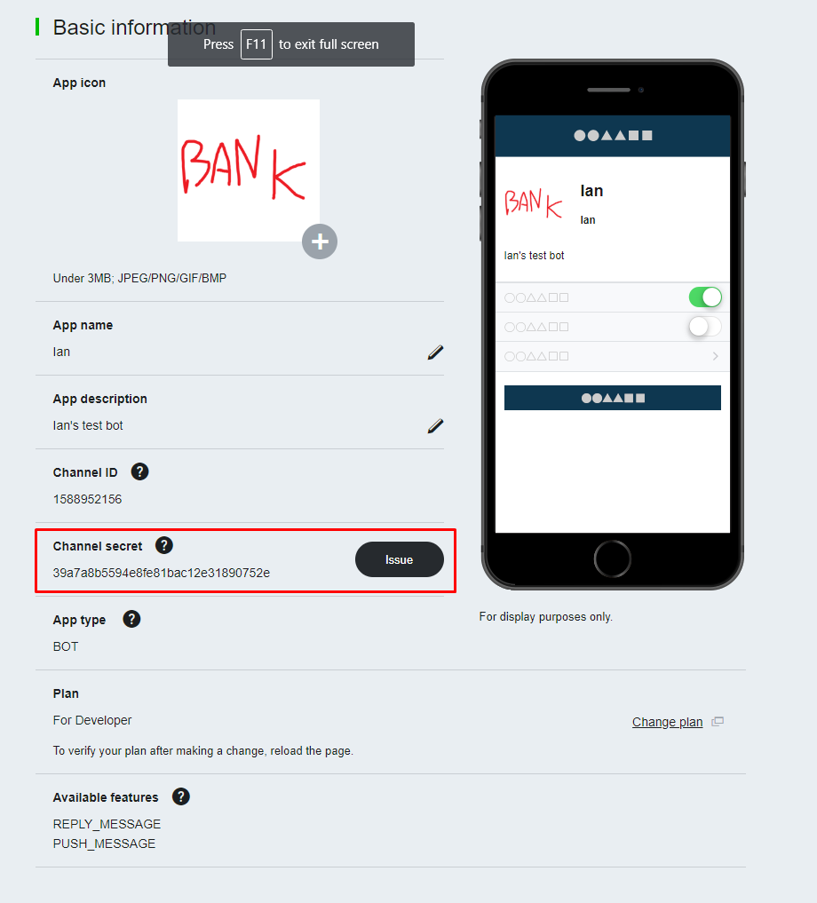
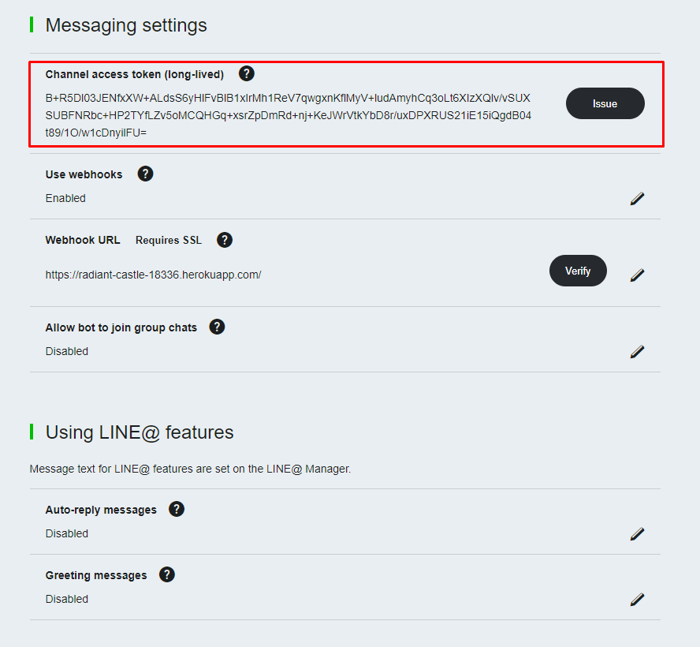

# Getting Started

Author: Ian Wang

## Setting up the project

If using Eclipse and Maven, just download the Project and import into your workspace.

If not, make sure the following dependencies are added to the project:

- [junit](https://junit.org/junit5/)
- [gson](https://github.com/google/gson)
- [httpclient](https://hc.apache.org/httpcomponents-client-ga/)
- [httpserver](https://docs.oracle.com/javase/8/docs/jre/api/net/httpserver/spec/com/sun/net/httpserver/HttpServer.html)

*NOTE :* The http library is only used to setup an HTTP server for the demo, if using another library to setup an HTTP server then the dependency is not needed.

**IMPORTANT NOTE :** Line Webhooks can only be received if the endpoint is using HTTPS and has an SSL certificate issued by an authorized cerfificate authority. *Heroku* is a good free option to use while testing.

---

<div style="page-break-after: always;"></div>

## Deploying to Heroku

### Requirements

- [Heroku CLI](https://devcenter.heroku.com/articles/heroku-cli)
- [Git](https://git-scm.com/)
- [Maven](https://maven.apache.org/)

If building the code from scratch, initialize the git repository first
> git init

Then make a commit for the current repository

> git add -A  
> git commit -m "Setup project"

If this is your first time using Heroku, you will need to login first. Create an account [here.](https://www.heroku.com/)
> heroku login

Then create the Heroku app from the repository
> heroku create

To deploy the server, just push the git repository to the heroku remote.
> git add -A  
> git commit -m "Commit/Deploy message"  
> git push heroku master

The URL of the endpoint should show up in the console. If you need it again, you can either find it on your Heroku dashboard, or type type the following command in your repository.
> heroku open

---

<div style="page-break-after: always;"></div>

## Setting up the Line Channel

First, you will need to setup a LINE bot channel. You can do so by following the instructions [here.](https://developers.line.me/en/docs/messaging-api/getting-started/)

In order to have your line Channel send webhook events to your server, you must let it know where your to send its WebHook events. To do so, go to your [LINE console](https://developers.line.me/console/) and find your channel. In the Channel Settings page, there should be a *Messaging settings* section. You can change the WebHookURL by clicking the pencil icon next to the WebHook URL header.



---

<div style="page-break-after: always;"></div>

## LINE Messaging API basics

Two very important properties of the LINE Channel are the **Channel Secret** and the **Channel Access Token**.

The **Channel Secret** is used to validate incoming WebHook event HTTP requests and verify that the request is sent by LINE and not a third party.

The **Channel Access Token** is an access token for the messaging API, and is divided into *short-lived* and *long-lived* channel access tokens. It is sent with HTTP requests to LINE endpoints to determine and validate the channel that is sending the messages. Short lived channel access tokens can be issued from the **/v2/oauth/accessToken** endpoint.





The LINE Messaging API is composed of two main parts, receiving and sending messages. The API aims to abstract away and simplify the interaction between the LINE Messaging API and your own code.

When an event, such as when a user adds your account or sends a message, is triggered, an HTTPS POST request is sent to the webhook URL that is configured for your channel on the console. Thus, your server needs to be configured to receive HTTPS requests that contain the event data.

Messages are sent by sending HTTPS POST requests to the Line Messaging API endpoints. There are two main ways to send messages, either by *reply* or *push*. Replies can be sent via a replyToken contained in incoming events, whereas push messages require the userId to be known beforehand. The demo contains an example of how to store userIDs to be able to send push notifications without the need of a replyToken.

---

<div style="page-break-after: always;"></div>

## More Notes

If writing your own *pom.xml* file to deploy to Heroku, it is important to set two fields in addition to the dependencies. One is the compiler/target version:

```xml

<properties>
    <maven.compiler.source>1.8</maven.compiler.source>
    <maven.compiler.target>1.8</maven.compiler.target>
</properties>
```

Another is the build field:

```xml
<build>
    <plugins>
        <plugin>
        <!-- Build an executable JAR -->
        <groupId>org.apache.maven.plugins</groupId>
        <artifactId>maven-jar-plugin</artifactId>
        <version>2.4</version>
        <configuration>
            <archive>
            <manifest>
                <mainClass>com.ian.push.rest.App</mainClass>
            </manifest>
            </archive>
        </configuration>
        </plugin>
        <plugin>
        <groupId>org.codehaus.mojo</groupId>
            <artifactId>appassembler-maven-plugin</artifactId>
            <version>2.0.0</version>
            <configuration>
                <assembleDirectory>target</assembleDirectory>
                <programs>
                    <program>
                        <mainClass>com.ian.push.demo.App</mainClass>
                        <name>line</name>
                    </program>
                </programs>
            </configuration>
            <executions>
                <execution>
                    <phase>package</phase>
                    <goals>
                        <goal>assemble</goal>
                    </goals>
                </execution>
            </executions>
        </plugin>
    </plugins>
</build>
```

Also, when deploying to Heroku it is important to have a Procfile. This file describes the commands the server should run for different scenarios, in our case we want the server to run our java application for the **web** setting. The Procfile thus contains just one line:
>web: sh target/bin/line

<div style="page-break-after: always;"></div>

## More References

- [Messaging API Documentation](https://developers.line.me/en/docs/messaging-api/)
- [Deploying Java Apps on Heroku](https://devcenter.heroku.com/articles/deploying-java)
- [Getting started with Maven](https://maven.apache.org/guides/getting-started/)
- [Heroku Procfile](https://devcenter.heroku.com/articles/procfile)
